# PathoVerse AI

### Multimodal Foundation Model Platform for Whole-Slide Pathology Analysis & Evaluation

PathoVerse AI is an end-to-end research and engineering platform for evaluating modern multimodal and vision foundation models on digital pathology workloads.

The platform brings together **Whole-Slide Image (WSI) processing, tissue-aware tiling, foundation-model embeddings, classification, attention-based Multiple Instance Learning (MIL), image retrieval, benchmark evaluation, and an interactive web interface** into a single local application.

It is designed around the challenges of digital pathology, where a single whole-slide image can contain millions of pixels and models must operate efficiently over thousands of tissue regions rather than a single conventional image.

---

## Overview

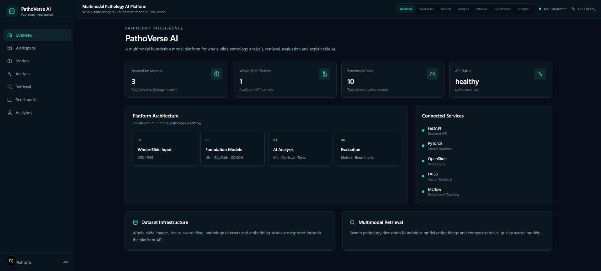

Digital pathology requires machine-learning systems to work with extremely large, high-resolution images while preserving both spatial context and computational efficiency.

PathoVerse AI provides a unified environment to:

- Process Whole-Slide Images (WSIs)
- Extract tissue-aware image tiles
- Generate embeddings using foundation models
- Compare foundation models on pathology tasks
- Perform patch-level classification
- Perform slide-level attention-based MIL
- Search visually similar pathology regions
- Generate attention heatmaps
- Evaluate model efficiency
- Track benchmark results
- Explore slides and model outputs through an interactive web application
- Expose the complete pipeline through a FastAPI backend

The project focuses on **engineering, evaluation, and research workflows**, rather than clinical diagnosis.

> **Important:** PathoVerse AI is a research and engineering platform. Its predictions and prototype MIL outputs are not intended for clinical diagnosis or medical decision-making.

---

# Key Features

## 1. Whole-Slide Image Analysis

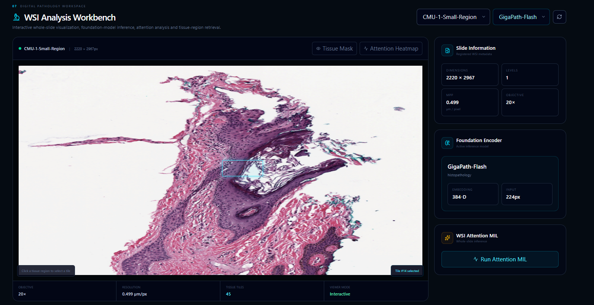
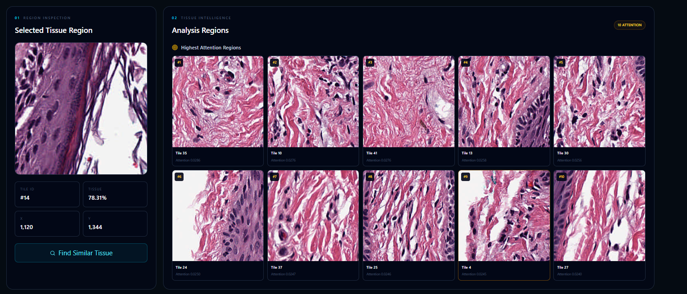
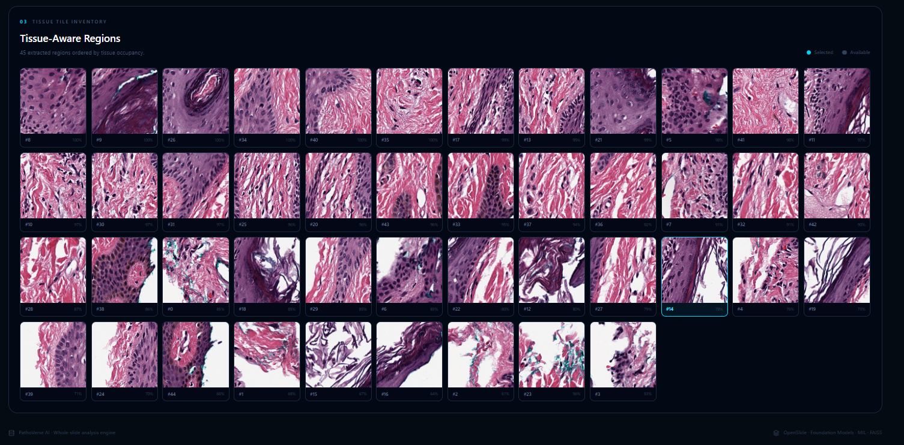

### Tissue-Aware Processing
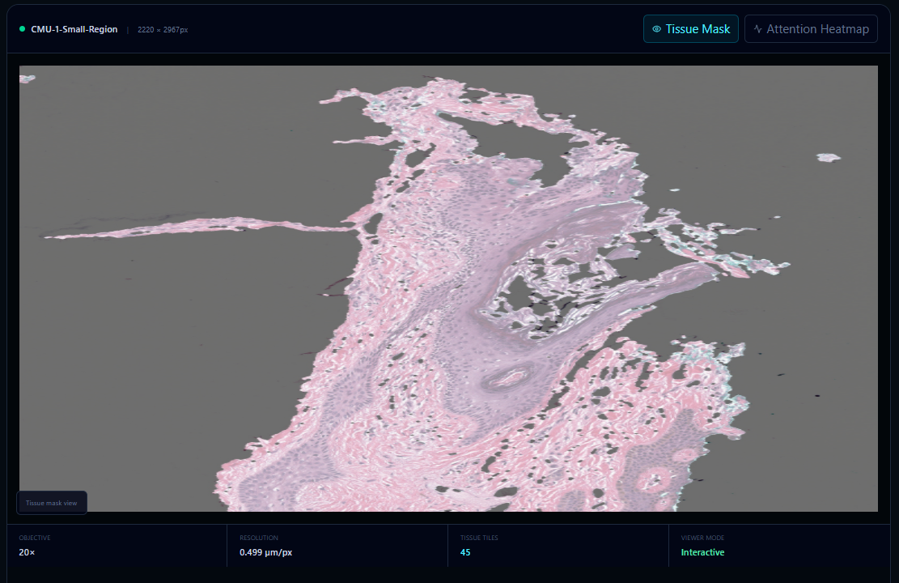

Supports pathology WSI workflows including:

- WSI metadata extraction
- Slide-level inspection
- Tissue detection
- Tissue-aware tile extraction
- Tile manifests
- Thumbnail generation
- Tissue-mask generation
- Tile-level visualization
- Slide-level analysis

The current evaluation uses an Aperio `.svs` pathology slide:

```text
CMU-1-Small-Region.svs
````

Slide characteristics:

```text
Format: Aperio SVS
Dimensions: 2220 × 2967
MPP: ~0.499 × 0.499
Objective: 20×
Extracted tiles: 45
```

---

# 2. Foundation Model Evaluation

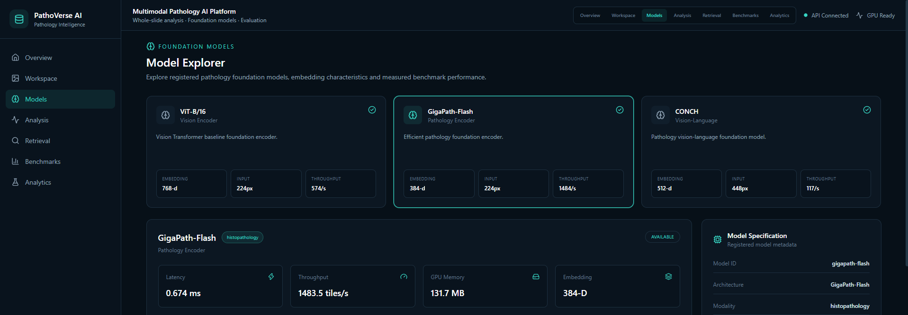
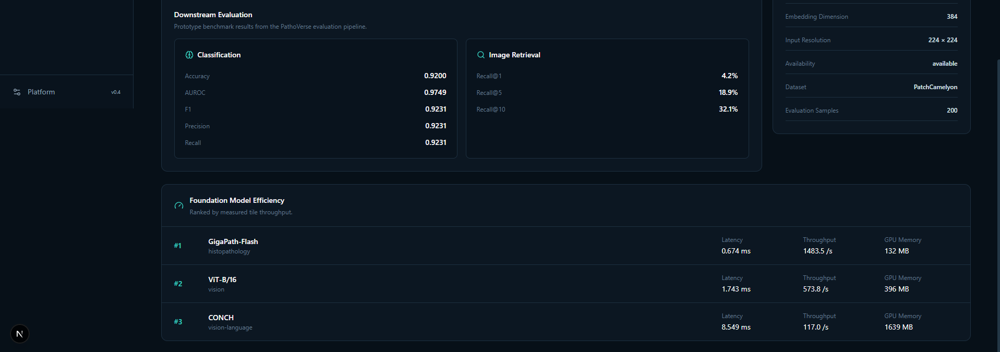


PathoVerse AI provides a common interface for evaluating different vision and vision-language foundation models.

Currently evaluated models include:

| Model          | Type                             |                       Embedding Dimension |
| -------------- | -------------------------------- | ----------------------------------------: |
| ViT-B/16       | Vision Transformer               |                                       768 |
| GigaPath Flash | Pathology Foundation Model       |                                       384 |
| CONCH          | Vision-Language Foundation Model |                                       512 |
| UNI / UNI2     | Pathology Foundation Model       | Supported architecture / access dependent |
| Prov-GigaPath  | Pathology Foundation Model       | Supported architecture / access dependent |

The platform uses a unified adapter/registry architecture so models can be evaluated through a common pipeline rather than requiring separate application logic for every model.

---

# 3. Pathology Classification

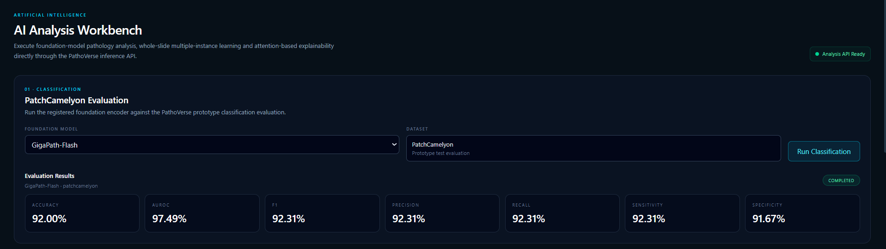
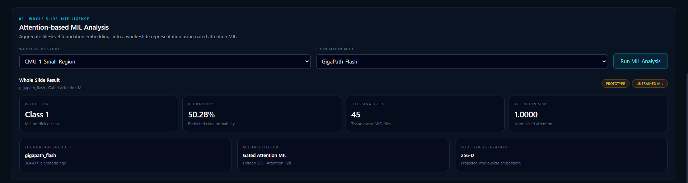

Patch-level classification experiments were performed using the **PatchCamelyon (PCam)** dataset.

A prototype embedding-based classification pipeline evaluates foundation-model representations using a linear classifier.

### Classification Benchmark

Evaluation performed on a 200-image test subset.

| Model              |   Accuracy |      AUROC |         F1 |  Precision |     Recall | Specificity |
| ------------------ | ---------: | ---------: | ---------: | ---------: | ---------: | ----------: |
| **GigaPath Flash** | **0.9200** | **0.9749** | **0.9231** | **0.9231** | **0.9231** |  **0.9167** |
| ViT-B/16           |     0.8200 |     0.9147 |     0.8182 |     0.8617 |     0.7788 |      0.8646 |
| CONCH              |     0.8050 |     0.9092 |     0.8116 |     0.8155 |     0.8077 |      0.8021 |

### Key observation

GigaPath Flash produced the strongest classification performance among the evaluated models on this benchmark subset, achieving:

```text
Accuracy : 92.00%
AUROC    : 0.9749
F1       : 0.9231
```

These results are benchmark results on the specified evaluation subset and should not be interpreted as clinical validation.

---

# 4. Foundation Model Efficiency

PathoVerse AI also evaluates inference efficiency over WSI tiles.

The standardized benchmark uses:

```text
WSI tiles: 45
Hardware: NVIDIA RTX PRO 4500 Blackwell
```

### Efficiency Benchmark

| Model              | Latency / Tile |            Throughput |
| ------------------ | -------------: | --------------------: |
| **GigaPath Flash** |   **0.674 ms** | **1483.52 tiles/sec** |
| ViT-B/16           |       1.743 ms |      573.83 tiles/sec |
| CONCH              |       8.549 ms |      116.97 tiles/sec |

### GigaPath Flash

```text
Latency       : 0.6741 ms/tile
Throughput    : 1483.52 tiles/sec
Peak GPU Mem  : 131.73 MB
Embedding Dim : 384
```

### ViT-B/16

```text
Latency       : 1.7427 ms/tile
Throughput    : 573.83 tiles/sec
Peak GPU Mem  : 396.42 MB
Embedding Dim : 768
```

### CONCH

```text
Load Time              : 4.1976 sec
Inference Time         : 0.3847 sec
Latency                : 8.5492 ms/tile
Throughput             : 116.97 tiles/sec
Peak GPU Memory        : 1638.56 MB
Embedding Dimension    : 512
Batch Size             : 4
```

These measurements provide a practical comparison between representation quality and computational cost.

---

# 5. Whole-Slide Multiple Instance Learning

PathoVerse AI includes an attention-based Multiple Instance Learning pipeline for slide-level analysis.

Implemented components include:

* Attention MIL
* Gated Attention MIL
* Slide-level embedding aggregation
* Tile-level attention scores
* Attention normalization
* Top-attended tile identification
* Attention heatmap generation

### Current WSI MIL Prototype

The current demonstration uses:

```text
Slide: CMU-1-Small-Region
Model: GigaPath Flash
Tiles: 45
MIL: Gated Attention MIL
Hidden Dimension: 256
Attention Dimension: 128
Classes: 2
Seed: 42
```

The attention weights are normalized:

```text
Attention Sum ≈ 1.0
```

The current MIL head is explicitly treated as an **untrained/prototype head**.

### WSI Attention Visualization
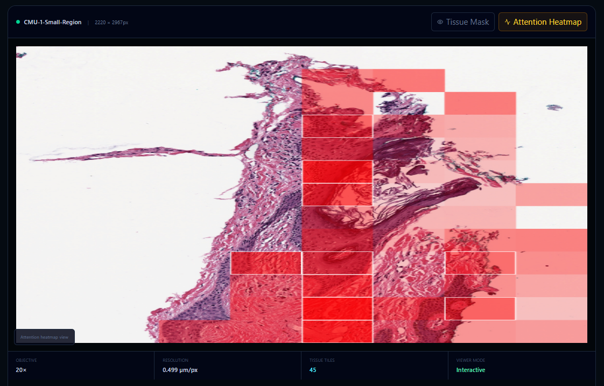

Therefore, the displayed slide-level probability is an engineering demonstration of the pipeline and attention mechanism rather than a trained clinical prediction.

---

# 6. Attention Heatmaps

PathoVerse AI converts tile-level MIL attention scores into spatial slide-level heatmaps.

The workflow is:

```text
WSI
 ↓
Tissue Detection
 ↓
Tile Extraction
 ↓
Foundation Model Embeddings
 ↓
MIL Attention
 ↓
Tile Attention Scores
 ↓
Spatial Mapping
 ↓
Attention Heatmap
```

This allows the system to visualize which regions contributed most strongly to the prototype MIL representation.

---

# 7. Image Retrieval

<table>
<tr>
<td width="50%" align="center">
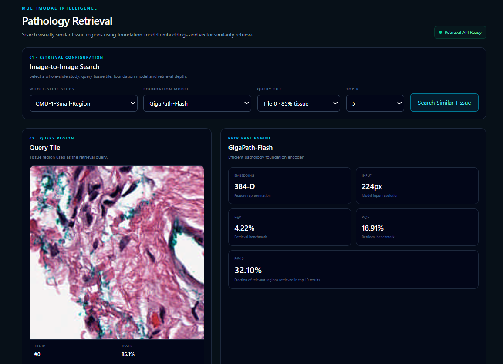
</td>
<td width="50%" align="center">
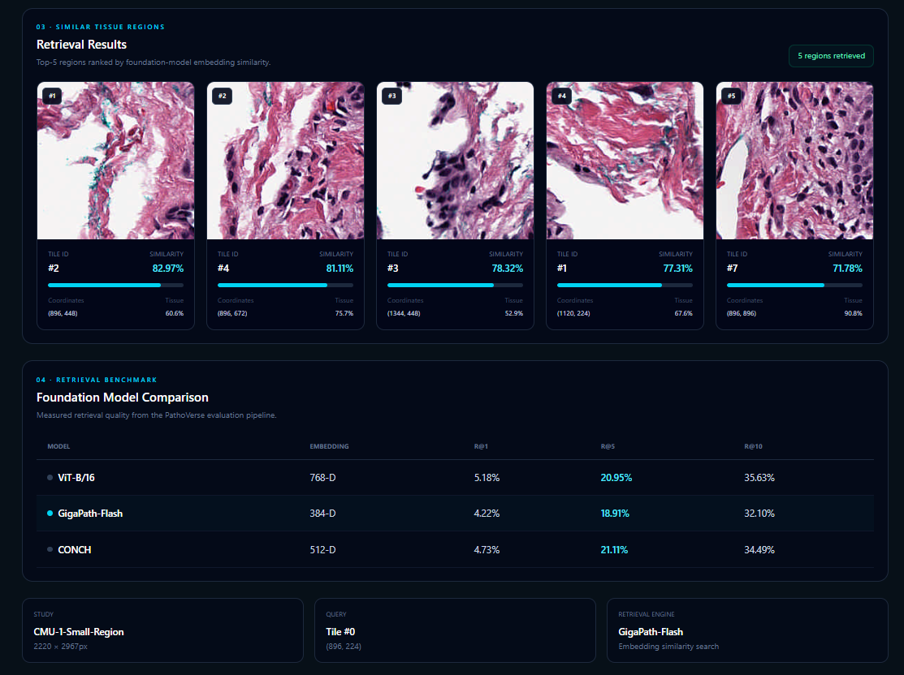
</td>
</tr>
</table>

PathoVerse AI provides embedding-based pathology tile retrieval.

The retrieval pipeline:

```text
Query Tile
    ↓
Foundation Model Encoder
    ↓
Query Embedding
    ↓
FAISS / Vector Search
    ↓
Top-K Similar Tiles
```

Supported embedding stores include FAISS indexes and NumPy-based embedding storage.

The current retrieval system supports:

* Query tile selection
* Model selection
* Top-K retrieval
* Similarity scores
* Tile visualization
* Retrieval leaderboard
* Image-text retrieval prototype with CONCH

### Retrieval Evaluation

The current retrieval benchmark uses manually assigned visual reference categories:

```text
Epithelial-rich : 20
Stroma/collagen-rich : 11
Mixed : 14
```

These labels are explicitly treated as a **manual visual-reference benchmark**, not as pathologist-verified clinical annotations.

### Recall Results

| Model          | Recall@1 |   Recall@5 |  Recall@10 |
| -------------- | -------: | ---------: | ---------: |
| ViT-B/16       |   0.0518 | **0.2095** | **0.3563** |
| GigaPath Flash |   0.0422 |     0.1891 |     0.3210 |
| CONCH          |   0.0473 | **0.2111** |     0.3449 |

CONCH produced the strongest Recall@5 in the current evaluation, while ViT-B/16 produced the strongest Recall@10.

---

# 8. Interactive Pathology Workspace

### Tile-Level Exploration
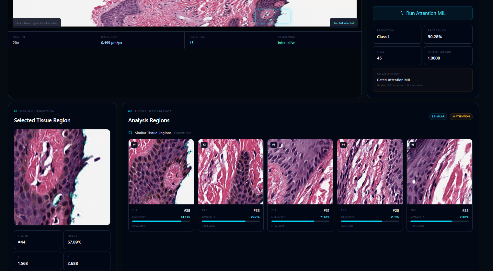

The web application provides an interactive pathology workspace for exploring:

* Whole-slide thumbnails
* Tissue masks
* Tile boundaries
* Individual tiles
* Tile metadata
* Foundation-model outputs
* MIL attention heatmaps
* Retrieval results

The workspace allows users to select individual tissue regions directly from the slide.

The viewer is intentionally designed as a static pathology workspace rather than a generic image editor.

---

# 9. Benchmark Dashboard

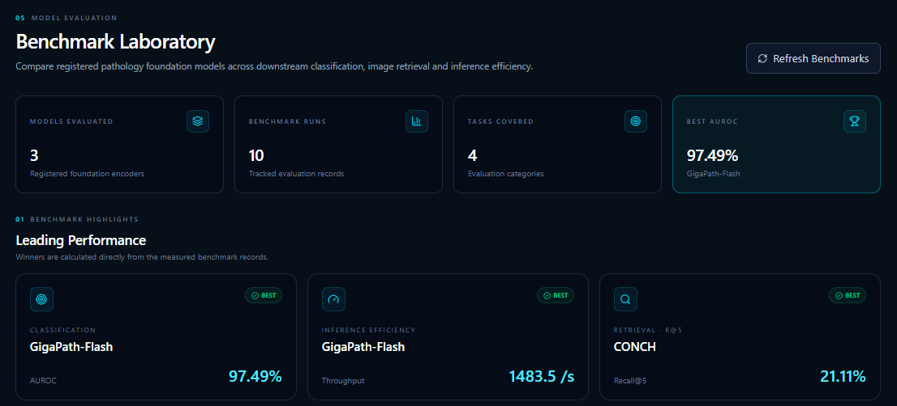
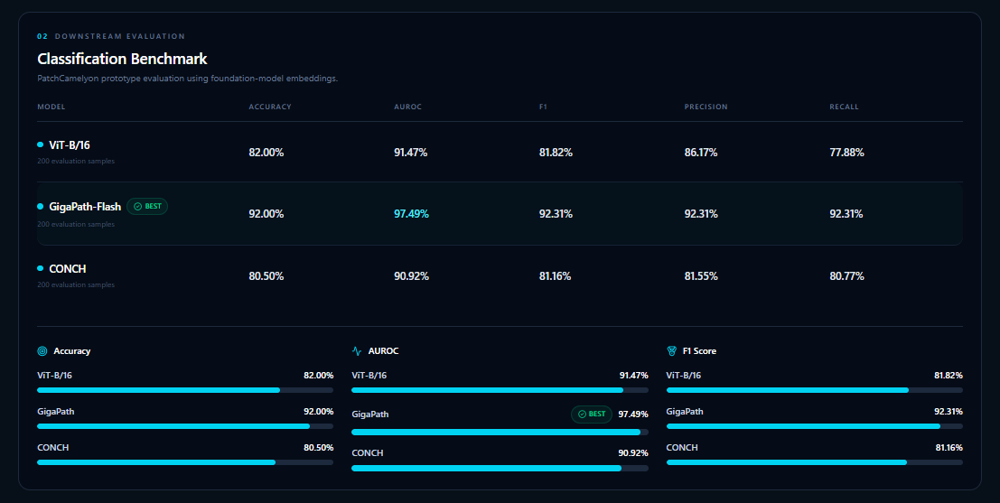
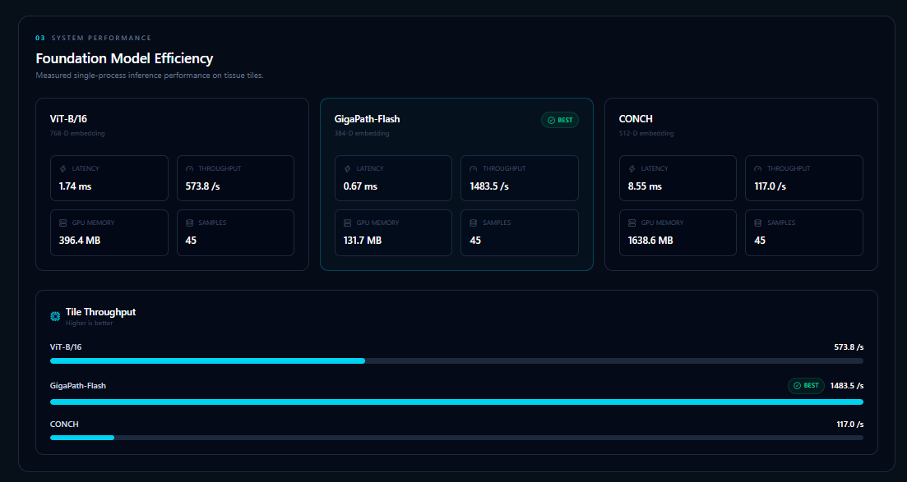
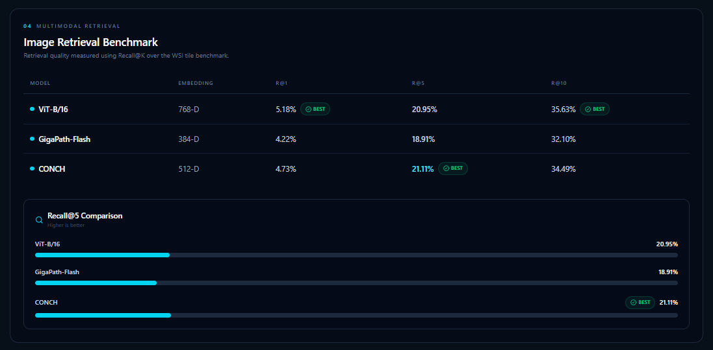
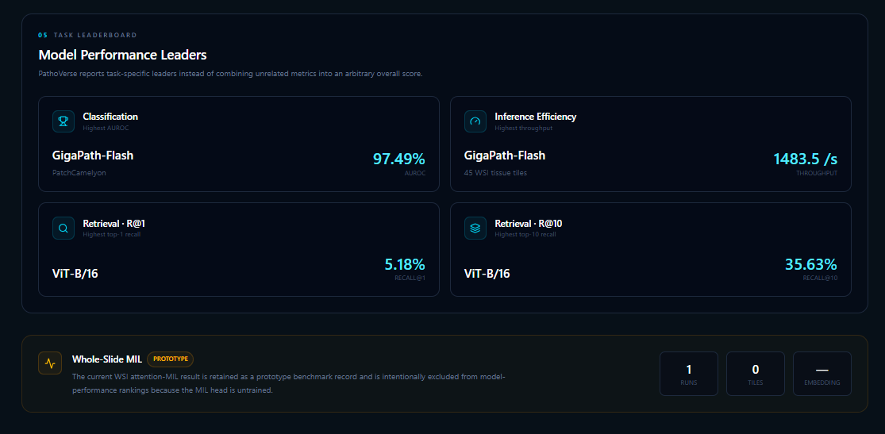

The benchmark interface provides a unified view of foundation-model performance.

It combines:

### Performance

* Accuracy
* AUROC
* F1
* Precision
* Recall
* Specificity

### Retrieval

* Recall@1
* Recall@5
* Recall@10

### Efficiency

* Latency
* Throughput
* GPU memory
* Embedding dimensions

### WSI / MIL

* Number of tiles
* Attention distribution
* Model configuration
* Prototype status

Benchmark artifacts are stored under:

```text
results/
```

and include machine-readable JSON/CSV results.

---

# 10. Analytics

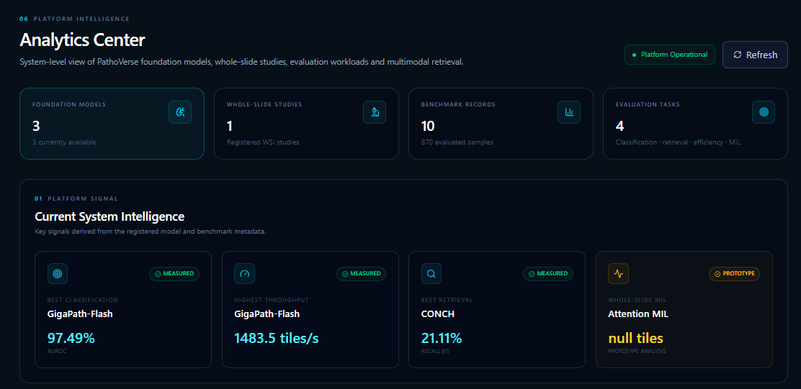
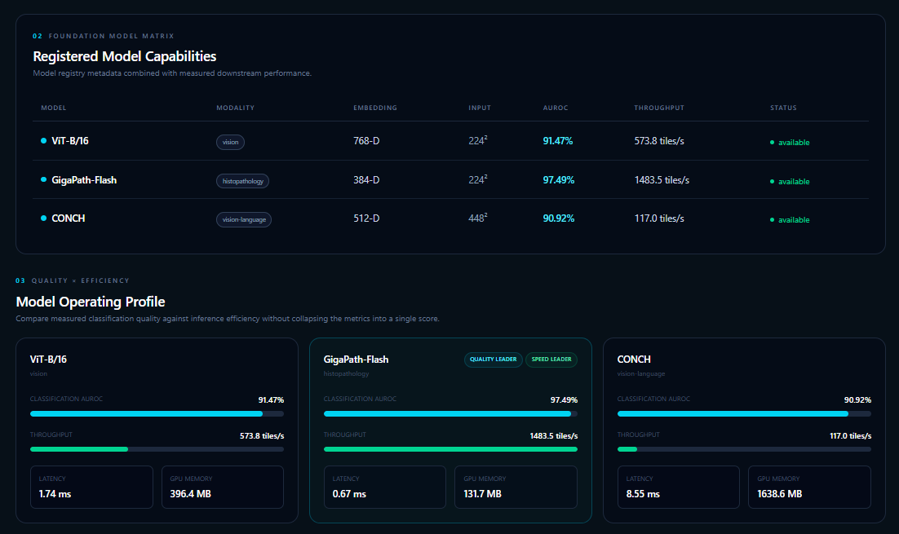
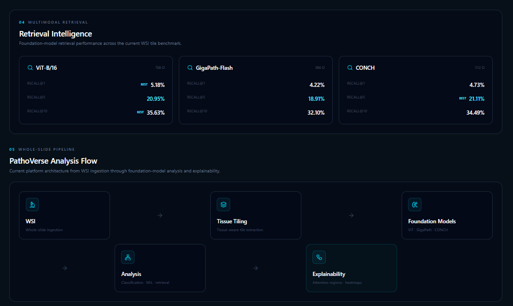
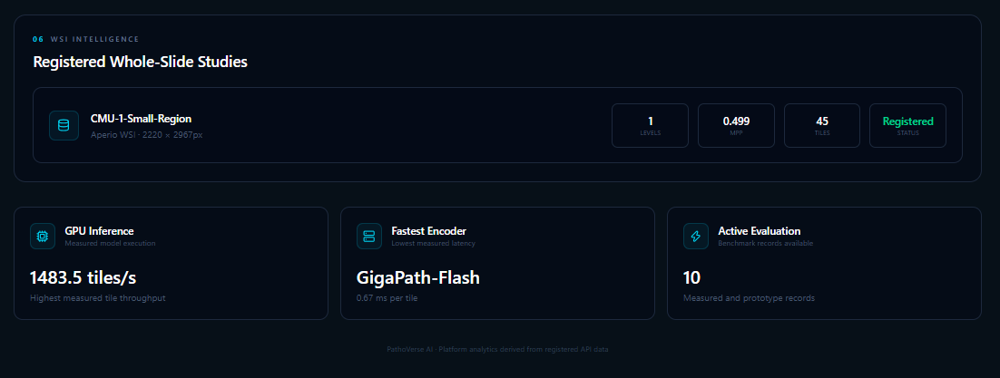

The analytics interface provides an engineering-oriented view of:

* Foundation-model comparison
* Benchmark summaries
* Model efficiency
* Classification performance
* Retrieval performance
* WSI/MIL analysis
* Evaluation artifacts

The backend benchmark collector provides a unified schema so results from different experiments can be compared consistently.

---

# System Architecture

```text
                         ┌───────────────────────────┐
                         │       Next.js Frontend     │
                         │                           │
                         │ Overview                  │
                         │ Workspace                 │
                         │ Models                    │
                         │ Analysis                  │
                         │ Retrieval                 │
                         │ Benchmarks                │
                         │ Analytics                 │
                         └─────────────┬─────────────┘
                                       │
                                  REST / JSON
                                       │
                                       ▼
                         ┌───────────────────────────┐
                         │       FastAPI Backend      │
                         │                           │
                         │ Health                    │
                         │ Models                    │
                         │ Slides                    │
                         │ Analysis                  │
                         │ Retrieval                 │
                         │ Benchmarks                │
                         └─────────────┬─────────────┘
                                       │
               ┌───────────────────────┼───────────────────────┐
               │                       │                       │
               ▼                       ▼                       ▼
        ┌──────────────┐       ┌──────────────┐       ┌──────────────┐
        │ WSI Pipeline │       │ Model Engine │       │ Benchmarking │
        │              │       │              │       │              │
        │ OpenSlide    │       │ ViT          │       │ Metrics      │
        │ Tissue Mask  │       │ GigaPath     │       │ Leaderboards │
        │ Tiling       │       │ CONCH        │       │ MLflow       │
        └──────┬───────┘       └──────┬───────┘       └──────────────┘
               │                       │
               └──────────────┬────────┘
                              ▼
                    ┌────────────────────┐
                    │ Embeddings / Tasks │
                    │                    │
                    │ Classification    │
                    │ MIL                │
                    │ Retrieval          │
                    │ Heatmaps           │
                    └────────────────────┘
```

---

# Technology Stack

## Backend

* Python 3.10
* FastAPI
* Uvicorn
* Pydantic
* PyTorch
* Torchvision
* Hugging Face Transformers
* timm
* MONAI
* OpenSlide
* NumPy
* Pandas
* SciPy
* scikit-learn
* scikit-image
* OpenCV
* FAISS
* MLflow

## Frontend

* Next.js 16
* React 19
* TypeScript
* Tailwind CSS
* Axios
* Lucide React
* Zod

## Machine Learning

* Vision Transformers
* Pathology Foundation Models
* Vision-Language Models
* Attention MIL
* Gated Attention MIL
* Linear probing
* Embedding-based retrieval
* FAISS similarity search

---

# Project Structure

```text
PathoVerse_AI/
│
├── README.md
├── LICENSE
├── .env.example
├── .gitignore
├── .python-version
├── pyproject.toml
├── requirements.txt
├── requirements.lock.txt
│
├── frontend/
│   └── Next.js application
│
├── src/
│   └── pathoverse/
│       ├── api/
│       │   ├── routes/
│       │   ├── schemas/
│       │   └── services/
│       │
│       ├── benchmark/
│       ├── classification/
│       ├── config/
│       ├── datasets/
│       ├── evaluation/
│       ├── explainability/
│       ├── mil/
│       ├── models/
│       ├── preprocessing/
│       ├── retrieval/
│       ├── tiles/
│       ├── wsi/
│       └── ...
│
├── scripts/
│   ├── model benchmarks
│   ├── dataset processing
│   ├── evaluation
│   └── result generation
│
├── tests/
│
├── configs/
│
├── docs/
│
├── data/
│   ├── raw/
│   ├── processed/
│   └── metadata/
│
├── models/
│   └── pcam_classification/
│
├── results/
│   ├── benchmarks/
│   ├── classification/
│   ├── retrieval/
│   ├── mil/
│   └── unified/
│
└── unwanted/
    ├── archive/
    ├── deployment/
    └── docker/
```

---

# Installation

PathoVerse AI is designed for local execution.

The intended workflow is:

```text
Clone
  ↓
Create Python virtual environment
  ↓
Install Python requirements
  ↓
Configure environment
  ↓
Start FastAPI backend
  ↓
Install frontend dependencies
  ↓
Start Next.js frontend
```

---

## 1. Clone the Repository

```bash
git clone https://github.com/KondetiAravind/PathoVerse-AI.git
cd PathoVerse-AI
```

---

# 2. Backend Setup

Create a Python 3.10 virtual environment:

```bash
python3.10 -m venv .venv
```

Activate it:

### Linux / macOS

```bash
source .venv/bin/activate
```

### Windows

```powershell
.venv\Scripts\activate
```

Upgrade pip:

```bash
python -m pip install --upgrade pip
```

Install dependencies:

```bash
pip install -r requirements.txt
```

---

# 3. Environment Configuration

Create the local environment file:

```bash
cp .env.example .env
```

Edit `.env` if model authentication or other optional configuration is required.

For models hosted through Hugging Face, a Hugging Face access token may be required depending on model access permissions.

Never commit private API keys or access tokens.

---

# 4. Start the Backend

From the repository root:

```bash
uvicorn pathoverse.api.main:app --reload --host 127.0.0.1 --port 8000
```

The backend will be available at:

```text
http://localhost:8000
```

API documentation:

```text
http://localhost:8000/docs
```

OpenAPI schema:

```text
http://localhost:8000/openapi.json
```

---

# 5. Frontend Setup

Open another terminal.

Navigate to the frontend:

```bash
cd frontend
```

Install Node dependencies:

```bash
npm install
```

Start the development server:

```bash
npm run dev
```

The frontend will be available at:

```text
http://localhost:3000
```

---

# Running the Complete Application

Two terminals are sufficient.

### Terminal 1 — Backend

```bash
cd PathoVerse_AI
source .venv/bin/activate

uvicorn pathoverse.api.main:app --reload --host 127.0.0.1 --port 8000
```

### Terminal 2 — Frontend

```bash
cd PathoVerse_AI/frontend

npm install
npm run dev
```

Then open:

```text
http://localhost:3000
```

---

# API Endpoints

### Interactive API Documentation
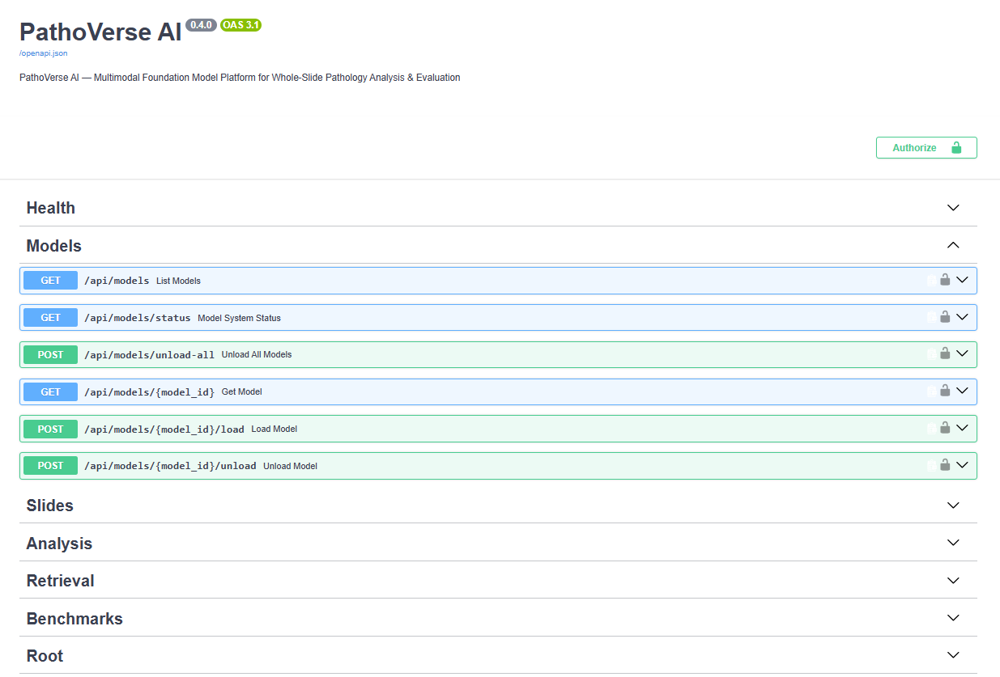

The FastAPI backend exposes endpoints for:

## Health

```text
GET /api/health
GET /api/health/live
GET /api/health/ready
```

## Models

```text
GET  /api/models
GET  /api/models/status
GET  /api/models/{model_id}
POST /api/models/{model_id}/load
POST /api/models/{model_id}/unload
POST /api/models/unload-all
```

## Slides

```text
GET /api/slides
GET /api/slides/{slide_id}
GET /api/slides/{slide_id}/thumbnail
GET /api/slides/{slide_id}/tissue-mask
GET /api/slides/{slide_id}/tiles
GET /api/slides/{slide_id}/tiles/{tile_id}/image
```

## Analysis

```text
POST /api/analysis/classification
POST /api/analysis/mil
GET  /api/analysis/{slide_id}/heatmap
```

## Retrieval

```text
POST /api/retrieval/search
```

## Benchmarks

```text
GET /api/benchmarks
GET /api/benchmarks/{task}
```

---

# Datasets

PathoVerse AI uses large pathology datasets that are intentionally **not stored in Git**.

This keeps the repository lightweight and avoids committing multi-gigabyte datasets.

## PatchCamelyon

The current experiments use PatchCamelyon for pathology classification.

The dataset contains:

```text
Train: 262,144 images
Validation: 32,768 images
Test: 32,768 images
Image size: 96 × 96
Channels: RGB
```

The local dataset is expected under:

```text
data/raw/patchcamelyon/
```

The raw dataset is ignored by Git.

---

## PathMNIST

MedMNIST PathMNIST is also used for dataset experimentation and validation.

The dataset is expected under:

```text
data/raw/medmnist/
```

---

## Whole-Slide Images

WSI files are expected under:

```text
data/raw/wsi/
```

The current WSI demonstration uses:

```text
CMU-1-Small-Region.svs
```

Large raw WSI files are not committed to the repository.

---

# Model Access

Some foundation models require authentication or gated access.

For example:

* GigaPath
* CONCH
* UNI / UNI2

Model availability depends on the user's Hugging Face access permissions.

The application is structured around a model registry and adapter architecture so additional foundation models can be integrated without redesigning the complete application.

---

# Reproducibility

PathoVerse AI separates:

```text
Source Code
Datasets
Model Weights
Experiment Outputs
```

Large datasets and downloaded third-party repositories are intentionally excluded from Git.

The repository contains:

* Source code
* Lightweight metadata
* Benchmark results
* Small classifier weights
* Test suite
* Configuration
* Frontend application
* Backend API
* Benchmark schemas

The exact dependency environment is additionally recorded in:

```text
requirements.lock.txt
```

---

# Benchmark Artifacts

Machine-readable benchmark artifacts are stored under:

```text
results/
```

Important outputs include:

```text
results/
├── benchmarks/
│   ├── vit_standard_benchmark.json
│   ├── gigapath_standard_benchmark.json
│   ├── conch_standard_benchmark.json
│   └── foundation_model_leaderboard.json
│
├── classification/
│   ├── vit_b_16_classification.json
│   ├── gigapath_flash_classification.json
│   ├── conch_classification.json
│   └── classification_leaderboard.json
│
├── retrieval/
│   ├── vit_b_16_retrieval_evaluation.json
│   ├── gigapath_flash_retrieval_evaluation.json
│   ├── conch_retrieval_evaluation.json
│   └── retrieval_leaderboard.json
│
├── mil/
│   ├── CMU-1-Small-Region_gigapath_flash_mil.json
│   └── CMU-1-Small-Region_gigapath_flash_attention_heatmap.png
│
└── unified/
    ├── foundation_model_benchmark.csv
    └── foundation_model_benchmark.json
```

---

# Testing

Backend tests can be executed with:

```bash
PYTEST_DISABLE_PLUGIN_AUTOLOAD=1 python -m pytest -v
```

The plugin-autoload setting prevents unrelated system-level pytest plugins from interfering with the project's test environment.

Frontend production build:

```bash
cd frontend
npm run build
```

---

# Engineering Design

The project follows a modular architecture.

## Model Adapter Layer

Models are accessed through common interfaces so that application code does not need to know the implementation details of each foundation model.

Conceptually:

```text
Model Registry
      ↓
Model Adapter
      ↓
Model Engine
      ↓
Embedding
      ↓
Task
```

This enables the same model to participate in multiple workflows:

```text
Classification
Retrieval
MIL
Benchmarking
```

---

# WSI Processing Pipeline

The WSI pipeline follows:

```text
Whole-Slide Image
        ↓
Metadata Extraction
        ↓
Thumbnail
        ↓
Tissue Detection
        ↓
Tissue Mask
        ↓
Tile Extraction
        ↓
Tile Quality Filtering
        ↓
Foundation Model Embedding
        ↓
Downstream Task
```

Downstream tasks include:

```text
Classification
MIL
Retrieval
Visualization
Benchmarking
```

---

# ML Evaluation Pipeline

The evaluation architecture is:

```text
Dataset / WSI
      ↓
Preprocessing
      ↓
Tile Extraction
      ↓
Foundation Model
      ↓
Embedding Store
      ↓
Task-specific Evaluation
      ↓
Metrics
      ↓
Unified Benchmark
      ↓
Leaderboard
```

This separation allows the same embedding representation to be reused across different downstream experiments.

---

# Limitations

PathoVerse AI is a research and engineering platform and has several limitations.

### Dataset scale

Current reported classification experiments use a sampled evaluation subset rather than the complete PatchCamelyon test set.

### MIL training

The current WSI MIL demonstration uses a prototype/untrained MIL head. Its output should not be interpreted as a validated clinical prediction.

### Retrieval labels

Current retrieval categories are manually assigned visual reference categories and are not pathologist-verified annotations.

### Clinical validation

The project has not undergone:

* Clinical validation
* Regulatory validation
* Prospective clinical testing
* Multi-institutional validation
* Diagnostic performance validation

### Model availability

Some foundation models require external authentication or gated model access.

### Hardware

Performance measurements depend on the GPU, PyTorch version, batch size, model implementation, and runtime configuration.

Therefore, benchmark numbers should be interpreted as measurements from the specified experimental environment rather than universal model performance.

---

# Future Work

Potential future development includes:

* Full WSI-scale benchmark evaluation
* Trained pathology-specific MIL heads
* More robust slide-level classification
* Multi-resolution WSI analysis
* Detection and segmentation models
* MedSAM-based segmentation workflows
* Larger retrieval evaluation sets
* Pathologist-verified retrieval annotations
* More foundation models
* Distributed WSI processing
* GPU batch optimization
* Mixed-precision inference
* Model quantization
* Tile caching
* Advanced experiment tracking
* User authentication and audit trails
* Collaborative pathology review
* Clinical validation workflows

---

# Project Status

### Current status: Functional research prototype / engineering platform

Implemented and tested:

* [x] FastAPI backend
* [x] Next.js frontend
* [x] WSI metadata processing
* [x] Tissue-mask generation
* [x] Tile extraction
* [x] Foundation-model adapters
* [x] ViT evaluation
* [x] GigaPath evaluation
* [x] CONCH evaluation
* [x] PatchCamelyon classification
* [x] Attention MIL prototype
* [x] WSI attention heatmap
* [x] Embedding-based retrieval
* [x] FAISS retrieval
* [x] Image-text retrieval prototype
* [x] Unified benchmarking
* [x] Benchmark leaderboard
* [x] Interactive pathology workspace
* [x] API documentation
* [x] Automated backend tests
* [x] Frontend production build

---

# Why PathoVerse AI?

PathoVerse AI is designed around a practical problem in modern computational pathology:

> **How can large pathology foundation models be evaluated, compared, and integrated into a single engineering workflow for high-resolution whole-slide analysis?**

Rather than implementing a single model demo, PathoVerse AI combines:

```text
WSI Engineering
        +
Foundation Models
        +
Representation Learning
        +
Classification
        +
Multiple Instance Learning
        +
Image Retrieval
        +
Benchmarking
        +
Interactive Visualization
        +
Production-style APIs
```

This makes the project a foundation for experimenting with large-scale digital pathology AI systems.

---

# Author

**Kondeti Aravind**

Dual Degree — B.Tech + M.Tech
Computer Science and Engineering
Indian Institute of Technology Bhubaneswar

GitHub:

[https://github.com/KondetiAravind](https://github.com/KondetiAravind)

Project:

[https://github.com/KondetiAravind/PathoVerse-AI](https://github.com/KondetiAravind/PathoVerse-AI)

---

# License

This project is intended for research, education and engineering experimentation.

---

## ⭐ If you found this project useful, consider giving it a star!
---

<p align="center">
  <strong>PathoVerse AI — Multimodal Foundation Model Platform for Whole-Slide Pathology Analysis & Evaluation</strong>
</p>

<p align="center">
  © 2026 Kondeti Aravind
</p>


